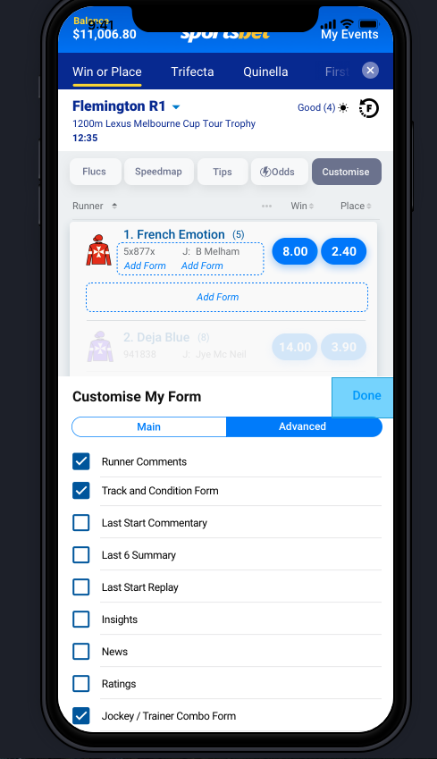
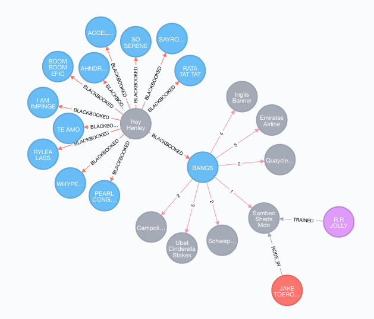
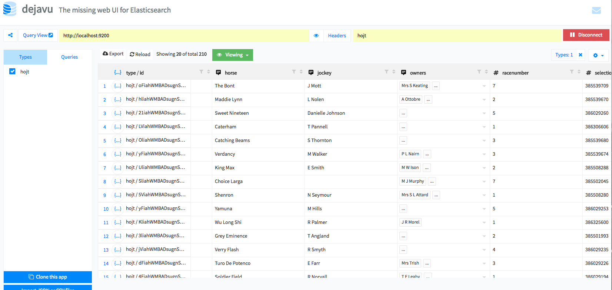
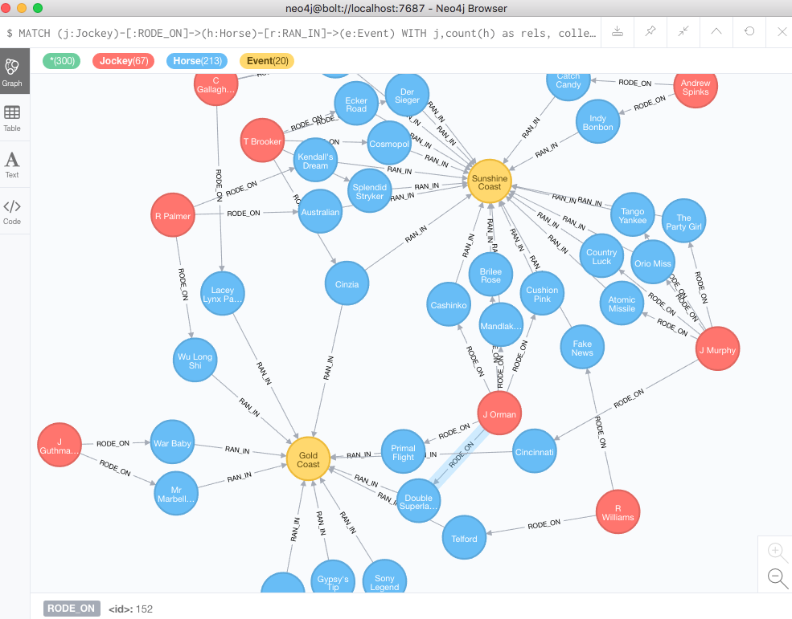

GraphDB(Neo4j) v Elasticsearch - Proof of Concept
=================================================

This is a Node.js application. It sources data about Horse/Jockey/Owner/Trainer from our existing API and writes this to either a
Neo4j Database or an Elasticsearch cluster. This was to prove out the idea that using a non relational DB option (GraphDB or Elasticsearch) gives valuable 
insights on the real world relationships between data entities that we don't currently have using Relational DB's. 

## Why could this be useful?
Our current OB data solution does not allow for easy relationships between these entities to be created or queried. The GOAT
project envisages a customer driven form component which would allow for customers to build their own insights and 
determine which relationships are important to them. 



## Prerequisites
1. Install Neo4j server locally
2. (via Neo4j UI) Create a new GraphDB called 'thoroughbreds'
3. (via Neo4j UI) Start the thoroughbreds database, create a new user (admin) with credentials jockey:jockeypass
4  (Optional) If importing data from CSV files, comment the config entry: dbms.directories.import=import to allow LOAD CSV to access files in other locations rather than in the 'import ' directory
5. Start the Neo4j DB prior to running the app (if using GraphDB)
6. Install Elasticsearch locally 
7. Start the Elasticsearch cluster prior to running the app (if using Elasticsearch)
8. (Optional) To allow for simple browsing/querying of Elasticsearch install the chrome extension https://chrome.google.com/webstore/detail/dejavu/jopjeaiilkcibeohjdmejhoifenbnmlh


## Preload GraphDB with thoroughbred csv files
Neo4j has an option to load data from files. For this PoC data was exported from IRRIS in a number of csv files
and a Cypher script created to load these into the database.

Before following these steps ensure the config changes in Prerequisites step 4 has been completed.

The csv files and cypher script are located in the csv_import directory.

 - horses_unique.csv (unique list of Horses)
 - jockey_unique.csv (unique list of Jockeys)
 - trainer_unique.csv (unique list of Trainers)
 - race_entries.csv (list of all race entries - with jockey, horse and trainer)
 - customers.csv (test data defining two customers)
 - blackbooks.csv (test data defining customer blackbook entries)

The cypher file can be executed using the cypher-shell command line component.
1. Open the Neo4j UI
2. Start the thorougbreds database
3. Open the terminal (via Neo4j UI)
4. Execute import_csv.cypher file via cypher-shell with the following command ensuring the full paths to the files are correct.

``
cat /Users/royh/git/royh/personal/graphdb---jockeydata/csv_import/import_csv.cypher | bin/cypher-shell -u jockey -p jockeypass
`` 

## Test Data
If the csv files have been loaded into Neo4j, there are a number of test nodes/relationships that exists to help
in allowing simple queries to be executed.

For example:
 - ``Customer (Node)`` 'Roy Henley' (customerID: 1000), ``BLACKBOOKED (Relationship)`` 12 Horses.
 - One of the ``Horse (Node)`` that Roy Blackbooked is 'Bangs' (horseID: 2597080).
 - Horse 'Bangs', ``RAN_IN (Relationship)`` the ``RaceEntry (Node)`` 'Sambec Sheds Mdn' race (which was race number 2 at this meet).
 - In this RaceEntry, 'Bangs', finished in 1st place.
 - Additionally, the ``Jockey (Node)`` 'JAKE TOEROEK' (jockeyID: 224076) ``RODE_IN (Relationship)`` 'Bangs', and the ``Trainer (Node)`` who ``TRAINED (Relationship)`` 'Bangs' was 'R R JOLLY' (trainerID: 6146)
 
 
 
## Configuration
Update the file config/config.js to include details for the locally installed Neo4j and Elasticsearch installations.

To switch between writing the data to Neo4j or Elasticsearch (or both) update the config entries:

```
use_neo4j : true|false
use_elastic : true|false
```


## Start the application

```
nvm use 9.11.1 
npm install
npm start
```

## Example Elasticsearch Queries
Delete index
```
curl -X DELETE "localhost:9200/hojt"
```

## Using the Elasticsearch GUI (dejavu)
If you have installed the Dejavu Chrome extension (optional prerequisite step) then you can use this to view/query the
data that has been written to Elasticsearch



## Example Cypher Queries - For Querying Neo4J
Delete all nodes and relationships
``` 
MATCH (n)
DETACH DELETE n
```

Find marching node based on property and label of the node
``` 
MATCH (h:Horse)
WHERE h.horseName = "CLARO EL BANCO"
return h;

MATCH (h:Horse)
WHERE h.horseID = "2633392"
return h;

```

Count all the nodes by distinct label (e.g. count all Horse, Owner, Jockey etc)
```
MATCH (n) 
RETURN DISTINCT count(labels(n)), labels(n);
```

Find all Jockeys who are racing more than 1 horse and return the details
```
MATCH (j:Jockey)-[:RODE_ON]->(h:Horse)-[r:RAN_IN]->(e:Event)
WITH j,count(h) as rels, collect(h) as horses, collect(e)as events, collect(r) as race
WHERE rels > 1
RETURN j,horses, rels, events, race
```


Q. How many customers have this horse/jockey/trainer in their blackbook?

A.
```
MATCH (:Customer)-[b:BLACKBOOKED]->(h:Horse {horseName: "TE AMO"}) 
WITH count(b) as rels
RETURN rels
```

Q. Show me RaceEntries where horse X/Jockey Y or Trainer Z is participating

A.
```
MATCH (:Horse {horseName: "TE AMO"})-[:RAN_IN]->(re:RaceEntry) 
RETURN re;

or

MATCH (:Trainer {trainerName: "D J HALL"})-[:TRAINED]->(re:RaceEntry) 
RETURN re;
```

Q. Show me the Trainers that this Jockey has worked with before	
A.
```
MATCH (j:Jockey {jockeyID: "222082"})-[:RODE_IN]->(re:RaceEntry)<-[:TRAINED]-(t:Trainer) 
RETURN t;
```

Q. What are the Horses that this Jockey has won on previously
A.
```
MATCH (Jockey {jockeyID: "222082"})-[:RODE_IN]->(RaceEntry)<-[r:RAN_IN]-(h:Horse) 
WHERE ( r.finishingPosition = "1") 
RETURN h;
```

Q. Show me races in the next few days with the jockey X/trainer Y combination is participating	
A.
```
MATCH (j:Jockey {jockeyID: "222082"})-[:RODE_IN]->(re:RaceEntry)<-[:TRAINED]-(t:Trainer{trainerID: "10"}) 
RETURN j,re,t;
```

## Using the Neo4j GUI
If you have installed the Neo4j Desktop application then you can use this to view/query the
data that has been written to Neo4j.



